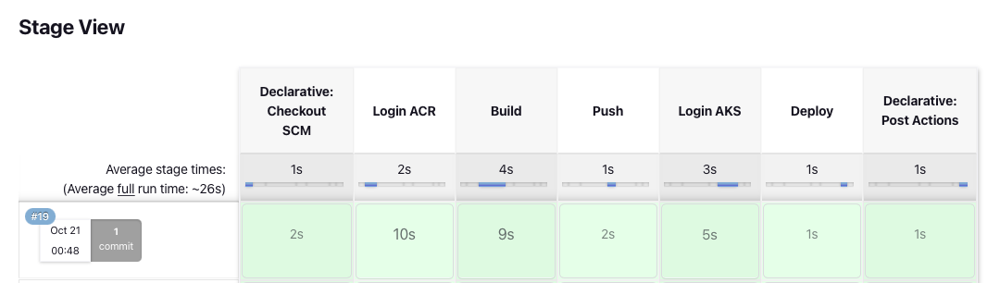
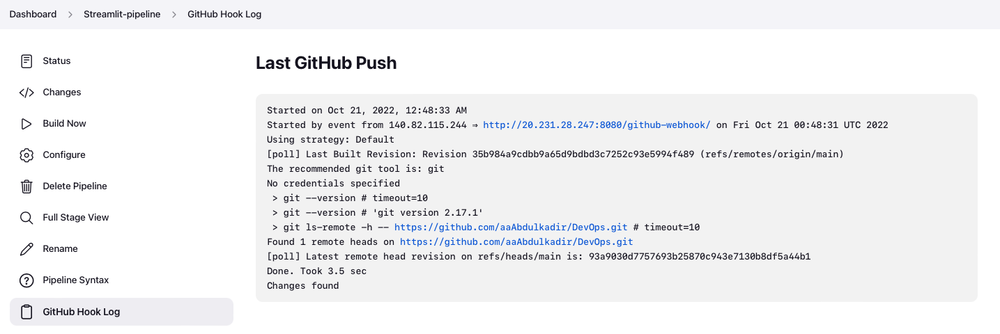
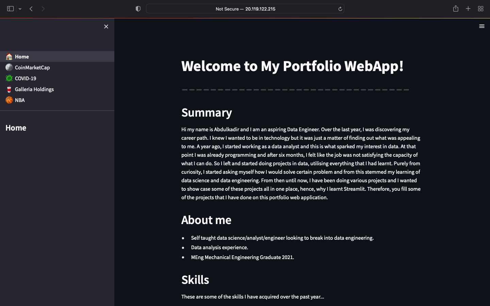

# Portfolio Web App CI/CD Pipeline

A cloud based CI/CD pipeline of my portfolio webapp created using Streamlit. Consisted of using Azure, Jenkins, ACR and AKS.

## Overview

This project consisted of creating a CI/CD pipeline using Jenkins for a portfolio web application created on Streamlit. Jenkins was provisioned on an Azure virtual machine. The Jenkins pipeline consists of a webhook to the GitHub repo which contains the files and pulls it into Jenkins The pipeline builds a docker image of the portfolio webapp and pushes it into Azure Container Registry, where the image uploaded is pulled to Azure Kubernetes Service to create a cluster of the application and deploy it.


## Diagram Explained

- Change application source code.
- Commit code to GitHub.
- Continuous Integration Trigger to Jenkins.
- Jenkins triggers a build job using Azure Container Service (AKS) for a dynamic build agent.
- Jenkins builds and pushes Docker container Azure Container Registry.
- Jenkins deploys new containerized app to Kubernetes on Azure Container Service (AKS).

## Walkthrough

### Terraform

Prerequesits: azure and terraform cli.

- Create a terraform file with the following:
    - Resource group
    - Container registry
    - Kubernetes cluster
    - Virtual machine

where the container registry is attached to the kubernetes cluster in the tfplan.

Once the file is ready, run the following:

```bash
az login
```
Log into Azure CLI so that terraform can push plan to Azure to account.

```bash
terraform init
```

```bash
terraform plan -out main.tfplan
```

```bash
terraform apply main.tfplan
```

After running the commands, the following should be seen on Azure:


### Setting up files

#### Docker

- The Dockerfile exposes port 8501 which is the port streamlit listens in at. However, to make it run on Azure, the port needs to be mapped:
    - Using a docker-compose file, make the host port 80 for 
    Azure map onto the container port 8501 for streamlit.

- Before running the docker-compose file, it needs to be given an image name that is tagged with the necessary azure extension:
    - Add image under webapp service with the correct name.
    - Tag the image with the container registry name + .azure.io + /{image_name} (which can be found inside the container registry access keys):
        - streamlitcontainerregistry.azurecr.io/portfolio-app:latest

- Once the docker image is created with the correct tag, it needs to be pushed to the container registry, which will be set up on the Jenkins server as on the server, it will build the image and then be pushed to the container registry, as shown in the following steps.

#### Kubernetes

- Make the image container the same as the docker image that is going to be pushed to the container registry.

### Setting up server

#### Logging in

Go to the connect blade under the Jenkins server VM group and type in the private key path and copy the ssh command to log into the VM.

```bash
ssh -i {path_to_key} {user}@{ip}
```

#### Downloading dependencies

Firstly, git clone the repo with all the files. After cloning repo, locate the config file which contains the download for jenkins, docker, docker comopse, azure cli and kubectl. Run it as follows:

```bash
git clone https://github.com/aaAbdulkadir/DevOps.git
```

```bash
cd DevOps/project/bash/
```

```bash
bash config-jenkins.sh
```

#### Starting up Jenkins

After running the config file, the VM should be ready to start up Jenkins and start creating the pipeline. Jenkins can be started up with the following command:

```bash
sudo systemctl start jenkins
```

Then, to see whether Jenkins is running succesfully, the following command can be used:

```bash
sudo systemctl status jenkins
```

The next stage is then to open the firewall so that port 8080 can be accessed locally. This can be done by going to the network blade under the VM on Azure and adding an inbound port rule.

-   Set the destination port ranges to 8080
-   Set the protocol to TCP
-   Set the priority to 100

Once that is done, Jenkins can be accessed via the public IP address and through port 8080 i.e. IP:8080.


To log into Jenkins, the admin password is needed and can be accessed by typing the following command in the VM:

```bash
sudo cat /var/lib/jenkins/secrets/initialAdminPassword
```
After clicking on install jenkins with recommended plugins, it is ready to use.

### Creating a Pipeline

#### Setting up ACR Credentials

In order to create a pipeline that pushes the docker image locally to Azure Container Registry, a credential needs to be set up to access this.

- To create a credential, firstly go to the container registry and click on the access keys blade. There should be a username and password which will be used to create a credential on Jenkins.

- On Jenkins, create a new global credential with the kind, username with password.

- Add the credential to the Jenkins script with the ID set.

#### Setting up Kubernetes Cluster via Kubectl

Connect to the kubernetes cluster by first setting up credentials for Azure CLI. Before doing that, a service prinicipal must be created as follows:

```bash
az ad sp create-for-rbac --scopes /subscriptions/{subscription_id} --role contributor
```

After, running this command, a list is printed on the CLI. Create a Jenkins credential with the appId, password and tenant id from this list of information seen on the CLI.

#### Pipeline

- Create a pipeline project.
- Tick github web trigger for GITScm polling as the build trigger.
- For pipeline, pick the pipeline script from SCM, where the SCM is Git. Paste the GitHub repository that contains the pipeline.
- Change the branch from master to main.
- Change the script path to 'project/Jenkins'.
- Save.

Now that the pipeline is set, build and see if it runs sucessfully.



#### Verificaiton

To view if the AKS is running succesfully, go to VM and type the following whilst logged into az cli:

```bash
az aks get-credentials --resource-group streamlit_project --name streamlit-aks
```

```bash
kubectl get svc
```

Take the external IP and using port 80, the website should bea ble to be accessed.

#### GitHub Webhook

To set up a Github Webhook:
- Go to the repository which is being pulled into Jenkins on GitHub and click on settings
-  From there, click on webhooks and add a webhook
-  Add the link which is being used to access the jenkins server and add /github-webhook/ i.e. ip:8080/github-webhook/ and create webhook.
- Change the content type to application/json
- Create webhook.

Once new code is pushed to the GitHub repository, the Jenkins pipeline should automatically run and can be viewed under 'GitHub Hook Log' inside the pipeline settings.



## Final Result



The website runs on the load balancer set with an external ip address and on the port 80.

## Improvements

### Ingress 

An Ingress may be configured to give services externally-reachable URLs and hence would be implemented in a real production environment. To improve this project and make it more realistic, getting a domain and deploying an ingress controller would be ideal.

- The deployment runs the pods of the containers
- The service runs the containers on an IP address and allows you to connect to the containers via the web
- The ingress redirects this IP to a domain.

### Unit Testing

Adding testing to a web application should be done as it ensures everything is running smoothly and find any issues with the code. However, I decided not to do any testing as looking into Streamlit, I do not think it was required, especially for the functionality of the website. Additionally, it is not a website I plan to make regular changes to.


## References: 
- https://learn.microsoft.com/en-us/azure/architecture/solution-ideas/articles/container-cicd-using-jenkins-and-kubernetes-on-azure-container-service
- https://learn.microsoft.com/en-us/azure/developer/jenkins/configure-on-linux-vm
- https://github.com/Azure-Samples/azure-voting-app-redis
- https://learn.microsoft.com/en-us/azure/developer/jenkins/deploy-from-github-to-aks