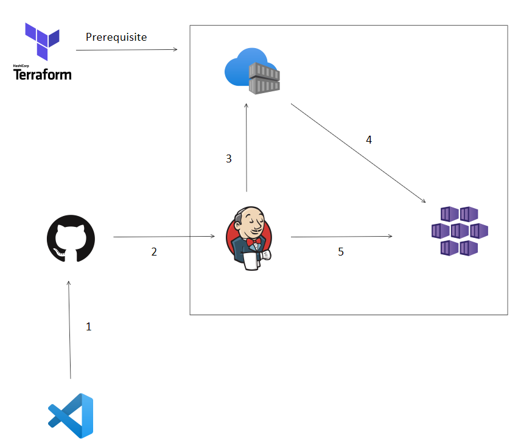
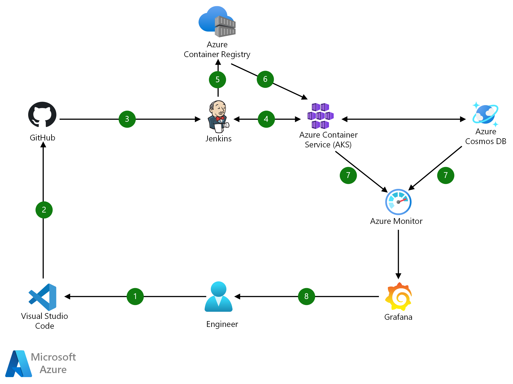

# Plan of the project

## Diagram 

Something among these lines

CI/CD using Jenkins on Azure Container Service (AKS)

## Diagram Explained

- Change application source code.
- Commit code to GitHub.
- Continuous Integration Trigger to Jenkins.
- Jenkins triggers a build job using Azure Container Service (AKS) for a dynamic build agent.
- Jenkins builds and pushes Docker container Azure Container Registry.
- Jenkins deploys new containerized app to Kubernetes on Azure Container Service (AKS).
- Grafana displays visualization of infrastructure and application metrics via Azure Monitor.
- Monitor application and make improvements.

## Method

- Create a Terraform plan to deploy:
    - A virtual machine for jenkins
    - AKS for the kubernetes cluster of the webapp
    - ACR to push the image of the webapp to this rather than dockerhub
    - App service plan
- After creating plan, download jenkins on the VM and connect it to the github repository with the webapp and configure webhook.
    - Build the image of the webapp, test, deploy.
- Deploy webapp to App service so it can be used.

## References: 
- https://learn.microsoft.com/en-us/azure/architecture/solution-ideas/articles/container-cicd-using-jenkins-and-kubernetes-on-azure-container-service
- https://learn.microsoft.com/en-us/azure/developer/jenkins/configure-on-linux-vm
- https://github.com/Azure-Samples/azure-voting-app-redis
