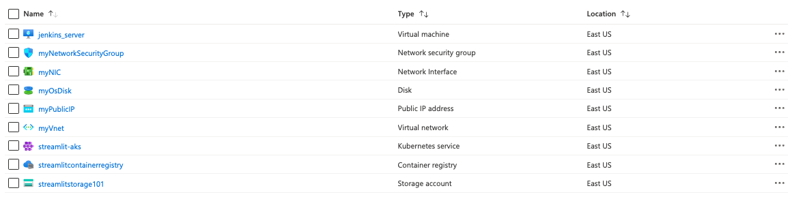

# Plan of the project


## Diagram 

Something among these lines


CI/CD using Jenkins on Azure Container Service (AKS)

## Diagram Explained

- Change application source code.
- Commit code to GitHub.
- Continuous Integration Trigger to Jenkins.
- Jenkins triggers a build job using Azure Container Service (AKS) for a dynamic build agent.
- Jenkins builds and pushes Docker container Azure Container Registry.
- Jenkins deploys new containerized app to Kubernetes on Azure Container Service (AKS).
- Grafana displays visualization of infrastructure and application metrics via Azure Monitor.
- Monitor application and make improvements.


## Method

- Create a Terraform plan to deploy:
    - A virtual machine for Jenkins
    - AKS for the kubernetes cluster of the webapp
    - ACR to push the image of the webapp to this rather than dockerhub
    - App service plan
- After creating plan, download Jenkins on the VM and connect it to the github repository with the webapp and configure webhook.
    - Build the image of the webapp, test, deploy.
- Deploy webapp to App service so it can be used. Maybe requires Jenkins connection to AKS, ACR.

Jenkins:
- Clones the GitHub repository
- Builds a new container image
- Pushes the container image to the ACR registry
- Updates the image used by the AKS deployment


## References: 
- https://learn.microsoft.com/en-us/azure/architecture/solution-ideas/articles/container-cicd-using-jenkins-and-kubernetes-on-azure-container-service
- https://learn.microsoft.com/en-us/azure/developer/jenkins/configure-on-linux-vm
- https://github.com/Azure-Samples/azure-voting-app-redis
- https://learn.microsoft.com/en-us/azure/developer/jenkins/deploy-from-github-to-aks

## Walkthrough

### Terraform

Prerequesits: azure and terraform cli.

- Create a terraform file with the following:
    - Resource group
    - Container registry
    - Kubernetes cluster
    - App service plan (change size)
    - Virtual machine

    where the container registry is attached to the kubernetes cluster in the tfplan.

    Once the file is ready, run the following:

    ```
    az login
    ```
    Log into Azure CLI so that terraform can push plan to Azure to account.

    ```
    terraform init

    terraform plan -out main.tfplan

    terraform apply main.tfplan
    ```

    After running the commands, the following should be seen on Azure:

    

### Setting up files

#### Docker

- The Dockerfile exposes port 8501 which is the port streamlit listens in at. However, to make it run on Azure, the port needs to be mapped:
    - Using a docker-compose file, make the host port 80 for 
    Azure map onto the container port 8501 for streamlit.

- Before running the docker-compose file, it needs to be given an image name that is tagged with the necessary azure extension:
    - Add image under webapp service with the correct name.
    - Tag the image with the container registry name + .azure.io + /{image_name} (which can be found inside the container registry access keys):
        - streamlitcontainerregistry.azurecr.io/portfolio-app:latest

- Once the docker image is created with the correct tag, it needs to be pushed to the container registry, which will be set up on the Jenkins server as on the server, it will build the image and then be pushed to the container registry, as shown in the following steps.

#### Kubernetes

- Make the image container the same as the docker image that is going to be pushed to the container registry.

### Setting up server

#### Logging in

Go to the connect blade under the Jenkins server VM group and type in the private key path and copy the ssh command to log into the VM.

```
ssh -i {path_to_key} {user}@{ip}
```

#### Downloading dependencies

Firstly, git clone the repo with all the files. After cloning repo, locate the config file which contains the download for jenkins, docker, docker comopse, azure cli and kubectl. Run it as follows:

```
git clone https://github.com/aaAbdulkadir/DevOps.git

cd DevOps/project/bash/

bash config-jenkins.sh
```

#### Starting up Jenkins

After running the config file, the VM should be ready to start up Jenkins and start creating the pipeline. Jenkins can be started up with the following command:

```
sudo systemctl start jenkins
```

Then, to see whether Jenkins is running succesfully, the following command can be used:

```
sudo systemctl status jenkins
```

The next stage is then to open the firewall so that port 8080 can be accessed locally. This can be done by going to the network blade under the VM on Azure and adding an inbound port rule.

-   Set the destination port ranges to 8080
-   Set the protocol to TCP
-   Set the priority to 100

Once that is done, Jenkins can be accessed via the public IP address and through port 8080 i.e. IP:8080.


To log into Jenkins, the admin password is needed and can be accessed by typing the following command in the VM:

```
sudo cat /var/lib/jenkins/secrets/initialAdminPassword
```
After clicking on install jenkins with recommended plugins, it is ready to use.

### Creating a Pipeline

#### Setting up ACR Credentials

In order to create a pipeline that pushes the docker image locally to Azure Container Registry, a credential needs to be set up to access this.

To create a credential, firstly go to the container registry and click on the access keys blade. There should be a username and password which will be used to create a credential on Jenkins.

On Jenkins, create a new global credential with the kind, username with password.

Add the credential to the Jenkins script with the ID set.

#### Setting up Kubernetes Cluster via Kubectl

Connect to the kubernetes cluster by first setting up credentials for Azure CLI. Before doing that, a service prinicipal must be created as follows:

```
az ad sp create-for-rbac
```

Make a credential on Jenkins for the rbac information. In order to this specific credential, an Azure plugin is needed and that is the 'Azure Credentials' plugin.

With the plugin installed, the information from the previous command can be inputted and a connection to Azure CLI can be established.

```
az login
```
Once logged in, copy the id seen in the CLI


```
az aks get-credentials --resource-group streamlit_project --name streamlit-aks
```

Check if it is connected to by typing the following command:

```
kubectl get nodes
```

#### Pipeline

- Create a pipeline project.
- Tick github web trigger for GITScm polling as the build trigger.
- For pipeline, pick the pipeline script from SCM, where the SCM is Git. Paste the GitHub repository that contains the pipeline.
- Change the branch from master to main.
- Change the script path to 'project/Jenkins'.
- Save.

Now that the pipeline is set, build and see if it runs sucessfully.


